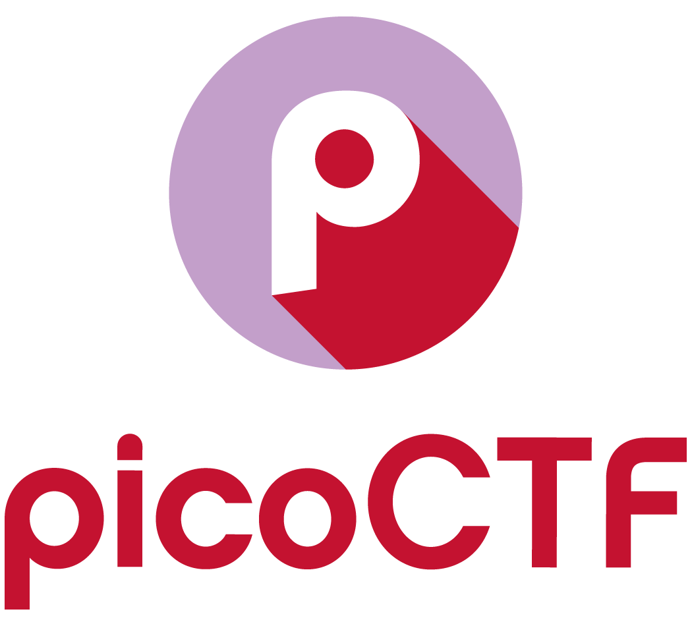

# picoCTF
[Profile](https://play.picoctf.org/users/hocnguyen12)

Repository containing my solutions and progress on the [picoCTF](https://play.picoctf.org/) platform.

## General Skills
- [x] binhexa
- [x] SuperSSH

## Cryptography
- [x] The numbers
- [x] interencdec
- [x] Hide to see
- [x] Mind your Ps and Qs
- [x] ReadMyCert
- [x] basic-mod1
- [ ] Custom encryption
- [ ] b00tl3gRSA2

## Forencics
- [x] St3g0
- [x] Wireshark doo dooo do doo...
- [x] Wireshark twoo twooo two twoo...
- [x] Verify
- [x] Secret of the Polyglot

## Reverse Engineering

## Web Exploitation
- [x] Secrets
- [x] Bookmarklet
- [x] Unminify
- [x] WebDecode

## Binary Exploitation

